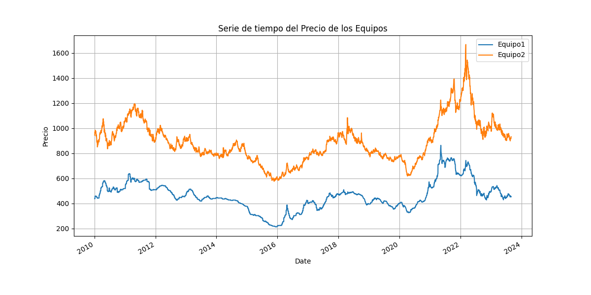

<h1 id="caso-1---estimación-de-costos-de-equipos-para-proyecto-de-construcción">Caso 1 - Estimación de costos de equipos para Proyecto de Construcción</h1>
<h2 id="explicación-del-caso">Explicación del caso</h2>

Una empresa se encuentran en la fase de planificación de un proyecto, donde son responsables de la mano de obra, materiales entre otros equipos necesarios para el proyecto.  Esta empresa contrata a un consultor para la estimación precisa de costos de dos equipos esenciales, los cuales tiene maneras diferentes de cotizar el costo respecto a las materias primas utilizadas. Se busca establecer un precio base confiable en función del costo de las materias primas. 
La forma en la que se componen los precios de los dos Equipos es la siguiente: 
** Equipo 1**: 20% la materia prima X y el resto por la metería prima Y 
** Equipo 2**: Esta conformado por partes iguales de las tres materias primas X, Y y Z

<h2 id="supuestos">Supuestos</h2>

1.-Se utilizan la misma moneda para expresar el costo de las materias primas 
2.- Solo se consideran fechas en las que hay información para las tres materias primas (X, Y y Z) 
3.- Se toma la columna “Date” como la fecha que se registró el precio de cada materia prima (X, Y y Z) 
4.- No se consideran costos logisticos como transporte y otros tipos de costos.

<h2 id="formas-de-resolver-el-caso-y-opción-tomada-en-esta-prueba">Formas de resolver el caso y opción tomada en esta prueba</h2>

El entender y calcular el procentaje de los costos por equipos es una cosa fundamental, debido que lo que estamos evaluando es un  posible precio base con forme al costo de los dos equipos, por lo que se plantearon diversas formas de aborar el problema: 
1.- Calcular el precio promedio mensual de cada materia prima <strong>No aprobada (no aplica ya que se perdería el detalle diario) ** 
2.-Establecer y seleccionar las fechas en la que hay información de las tres materias primas y aplicar las fórmulas correspondientes para calcular el precio según cada equipo ** Aprobada</strong>.

Debido a que de momento y apegándonos a lo que se pide en el caso, la segunda opción es la más optima porque permite conservar la precision temporal diaria, el proceso que se siguió fue:

1.- Lectura de datos 
2.- Limpieza y estandarización de los datos de los tres DataFrames 
3.- Conversion de fechas en formato estándar(‘datatime’) 
4.- Union de los tres DataFrames  con fechas que existan en los tres conjuntos de datos. 
5.- Calcular los precios de los equipos con respecto a su forma de estimar los costos. 
6.- Visualización de resultados de ambos equipos en una gráfica de series temporales.

<h2 id="resultado-del-análisis-de-datos-y-de-los-modelos">Resultado del análisis de datos y de los modelos</h2>

Después de ejecutar el proceso, se obtuvieron los siguientes resultados: 
Promedio del equipo 1: <strong>$460.03988895184136</strong> 
Promedio del equipo 2: <strong>$890.3500648970028</strong> 
Precio máximo equipo 1: <strong>$863.76</strong> 
Precio máximo equipo 2: <strong>$1,668.05333</strong> 
Adicionalmente se generó una <strong>gráfica de series temporales</strong> para poder visualizar la evolución del precio estimado de ambos equipos, esto con datos con fechas simultaneas, excluyendo fechas que no cumplen con este requisito.  Con esta grafica se podrían observar tendencia de aumento de precio o puntos de alerta para decisiones futuras:

<h2 id="futuros-ajustes-o-mejoras">Futuros ajustes o mejoras</h2>

Con un análisis más profundo y con más información, se podrían evaluar también los factores como los costos logísticos, variación del tipo de cambie, inflación entre otros factores que podrían alterar el precio, Al igual que aplicar modelos de predicción para poder estimar futuros precios.

<h2 id="apreciaciones-y-comentarios-del-caso">Apreciaciones y comentarios del caso</h2>

Durante el planteamiento del proceso de union de datos por fecha, se eliminaron registros históricos que no contaban con información completa de las tres materias primas, por lo tanto, el análisis se centró solo en las fechas donde se tiene registro de manera simultánea en las tres materias primas asegurando consistencia en los cálculos. Con esto se garantizó que el análisis es sólido, confiable y con datos consistentes.

